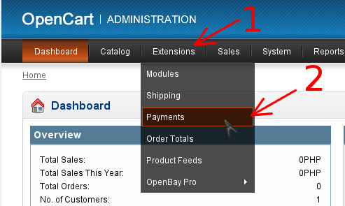

# Настройка плагина

1. Перейдите в панель администрирования OpenCart
2. Перейдите в раздел управления платежными модулями
    1. Выберите в левом меню раздел "Extensions" (стрелка #1)
    2. Выберите в открывшемся списке пункт "Payments" (стрелка #2)

    
2. Установите модуль PaynetEasy
    1. Выберите модуль в списке, и нажмите "Install" (стрелка #1)

    
3. Перейдите в режим редактирования настроек модуля (стрелка #1)

    
4. Настройте модуль
    1. Заполните форму
    2. Сохраните настройки (стрелка #1)

    
