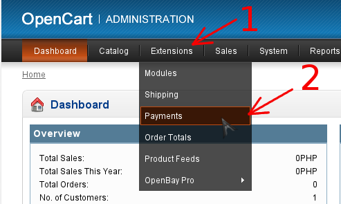
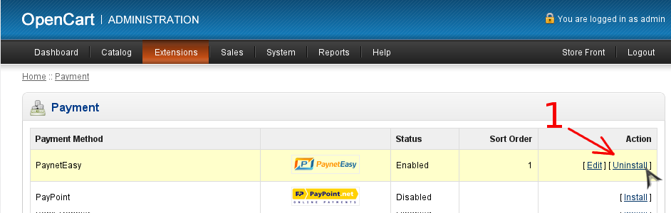

# Удаление плагина

## Удаление модуля в панели администрирования

1. Перейдите в панель администрирования OpenCart
2. Перейдите в раздел управления платежными модулями
    1. Выберите в левом меню раздел "Extensions" (стрелка #1)
    2. Выберите в открывшемся списке пункт "Payments" (стрелка #2)

    
3. Удалите модуль
    1. Выберите модуль в списке, и нажмите "Uninstall" (стрелка #1)

    

## Удаление файлов плагина

Для полного удаления плагина необходимо удалить некоторые папки и файлы. Пути к ним даны относительно корневой папки OpenCart. Список файлов и папок для удаления:

* `admin/controller/payment/payneteasy_form.php`
* `admin/language/english/payment/payneteasy_form.php`
* `admin/model/payment/payneteasy_form.php`
* `admin/view/image/payment/payneteasy.png`
* `admin/view/template/payment/payneteasy_form.php`
* `catalog/controller/payment/payneteasy_form.php`
* `catalog/language/english/payment/payneteasy_form.php`
* `catalog/model/payment/payneteasy_form.php`
* `catalog/view/theme/default/template/payment/payneteasy_form_checkout.php`
* `catalog/view/theme/default/template/payment/payneteasy_form_error.php`
* `vendor/composer/`
* `vendor/payneteasy/`
* `vendor/autoload.php`